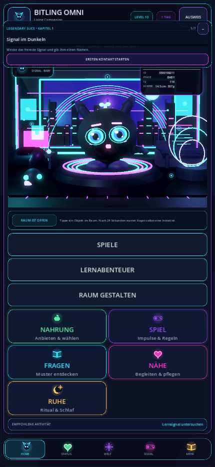

# Bitling: Reparatur und Review vom 27.09.2026

**Status: REVIEW.** Dieser Stand repariert konkrete Bedienungs- und Speicherfehler des vorhandenen Spiels. Er ist keine Freigabe für Veröffentlichung, App Store oder Play Store.

- Ausgangscommit: `b8eefbcac5fdac6cf225ee3ef7b543fbfb33cdee`
- Arbeitsbranch: `repair/playable-core-20260927`
- Ziel: den bestehenden Bitling-Spielkern durchgängig bedienbar machen und die Änderungen mit reproduzierbaren Regressionen absichern.
- Prüfgrundlage: tatsächlicher Code, gezielte Fehlerreproduktionen und ausgeführte Godot-Tests. Frühere Qualitätsbezeichnungen im Repository ersetzen diese Nachweise nicht.

## Nachtrag: LUMO-Bewegung, Lernqualität und Lizenzen

Aufbauend auf `75e25764db36b04b5ca8c9609fd8aacf29aac36b` ist die vom Nutzer gewünschte LUMO-Bildsprache im Lernkatalog und den Lernabenteuern eingebunden. Der Begleiter bewegt Kopf, Ohren, Schweif, Pfoten und Atem über eine echte texturierte 2D-Geometrie; die Insel bleibt verankert. Ein zweites generiertes Asset schließt nur die Augenbereiche. Berührung, richtige Lösungen und gemeinsames Nachdenken lösen unterschiedliche Reaktionen aus. Reduzierte Bewegung stoppt Animation und Blinzeln; vollständig ausgeblendete oder weggeclipte Figuren pausieren. Neue Runden und erneutes Öffnen löschen alte Ergebnisreaktionen. Der Fokusrahmen ist vom Blinkmaterial getrennt. Das ist ein interaktiver 2D-Begleiter im Lernbereich, noch kein vollständiger Ersatz der Habitatfigur oder Satz von Geh-, Fütter- und Bauanimationen.

Die Rückmeldung zeigt nun die tatsächlich beantwortete Frage, Auswahl, passende Lösung und Erklärung bis zum bewussten Weitergehen. Doppelte beziehungsweise veraltete Eingaben können keine zusätzliche Runde beantworten. Das Lernfenster korrigiert seine tatsächliche Skalierung in schmalen Desktopfenstern; die Rückmeldung wird sichtbar gescrollt. Antwortreihenfolgen sind deterministisch gemischt, drei Runden wiederholen nicht dieselbe Kontextaufgabe. Zusätzliche eigene Aufgaben erweitern die Szenariobanken. Im Profil sind die vollständigen Lizenztexte des laufenden Godot-Binaries offline erreichbar.

Die vier neuen Suiten prüfen 166 Bedingungen unter Linux: Lernfeedback 38, Aufgabenqualität 69, Open-Source-Lizenzen 24 und Animation 35. Die Qualitätsprüfung untersucht 2.592 Kombinationen von Bereich, Seed, Schwierigkeit und Runde. Insgesamt bestanden zwölf gezielt ausgewählte Integrationssuiten. Nach dem letzten Animationsfix wurden Animation, Feedback, Lernfokus und visuelle Integration erneut ausgeführt. [Linux-Ergebnisse](repair-evidence/20260927/learning-quality/linux-verification.json), [Quellhashes](repair-evidence/20260927/learning-quality/source-sha256.json).

Die abschließende Mac-Prüfung umfasst dieselben vier neuen Suiten sowie Profil- und Lernfokus; das Aufgabenbankverfahren läuft headless, die übrigen fünf mit echter Vulkan-Darstellung. Zwei zusätzliche Screenshotprüfungen gehören zum Mac-Feedbacktest. Die isolierte Bewegungsprobe zeichnet dieselbe Spielkomponente in 180 gerenderten Frames auf. Sie ist keine Aufnahme eines vollständigen Spielverlaufs und kein iPhone-Test. [Mac-Ergebnisse](repair-evidence/20260927/learning-quality/mac-verification.json), [Bewegungsprobe](repair-evidence/20260927/learning-quality/lumo-motion.mp4).

Die Entwicklungsgates bestehen; der Releasecheck meldet weiterhin 0 Fehler, 5 Blocker und jetzt 89 Warnungen. Bekannte ObjectDB-Abschlusswarnungen bleiben sichtbar. GitHub Actions konnte den vorherigen Commit wegen einer Abrechnungssperre nicht starten; dafür wurde keine kostenpflichtige Einstellung verändert. Die Quellen und Grenzen des Vergleichs mit Talking Tom, Animal Crossing, Stardew Valley und DragonBox stehen in der [verifizierten Spielrichtung](GAME_DIRECTION_VERIFIED_20260927.md). Aktuelle Marktführerschaft, Überlegenheit und Lernwirksamkeit werden nicht behauptet.

**Weiter offen:** Der Lernabschluss behandelt Speicherfehler noch nicht vollständig; getrennte Stores bilden keine gemeinsame Transaktion. Inhaltsumfang, echte Transferaufgaben, fachliches Review, Hardwareprüfungen und Storevoraussetzungen bleiben Arbeitspakete. Der vorhandene Mac mit macOS 12.7.6/Xcode 14.2 ermöglicht diese Desktopprüfungen, erfüllt aber nicht Apples aktuellen Store-Buildpfad.

## Nachtrag: Minispiel-Abschluss und Neustart

Die erneute Prüfung fand einen bisher nicht abgedeckten Typfehler beim echten Abschluss von Resonanztakt: Die Interaktions-Tags wurden als untypisiertes Array übergeben. Außerdem wurden XP und Pflegewerte der Minispiele nicht unmittelbar gespeichert, obwohl die Oberfläche dies behauptete.

Der Abschluss speichert nun zentrale Werte und Ergebnishistorie, bevor die Erfolgsmeldung erscheint. Bei einem Schreibfehler bleibt die Meldung ehrlich und bietet erneutes Speichern an. Dieser Versuch vergibt keine weitere Belohnung und zählt keine weitere Spielrunde. Blockierte zentrale Spielstände verhindern auch Änderungen an der Minispielhistorie. Simulationen vergeben weiterhin keine Belohnungen.

Nachweis: Die erste Reproduktion meldete 10 fehlgeschlagene Assertions und den Rhythmus-Typfehler. Nach der Korrektur bestehen 24 Abschluss-/Fehlerpfadprüfungen und 4 Prüfungen in einem neu gestarteten Prozess unter Linux und macOS. Auf dem Mac lief die Abschlusssuite mit echter Darstellung. Die vorhandenen Activity-Session-, Legendary-Slice-, Journey-, Save-Recovery-, Core- und Release-Tests bestanden ebenfalls unter Linux. Die neue Suite samt Prozessneustart ist in CI eingetragen. [Nachtrag-Evidenz](repair-evidence/20260927/activity-persistence/verification.json).

Dies schließt den konkreten Minispielverlust beim normalen Neustart. Ein atomarer Gesamtspielstand über alle getrennten Stores und die bisherigen Storeblocker bleiben offen. Der dokumentierte GitHub-Actions-Lauf des Ausgangscommits konnte wegen einer Abrechnungssperre keine Testschritte starten.

## Reparierter Umfang

| Bereich | Fehler und Änderung |
| --- | --- |
| HOME | Der Einstieg öffnete eine zweite Haustierbühne ohne angebundene Habitat-Auswahl. HOME führt nun zur vorhandenen interaktiven Hauptbühne. Die Raumgestaltung bleibt separat erreichbar. |
| Fünf Haltungen | Die alten Beschriftungen versprachen direkte Aktionen, änderten aber nur die ausgewählte Haltung. Nahrung, Spiel, Fragen, Nähe und Ruhe beginnen jetzt eine echte Handlung mit drei Wahlmöglichkeiten. Die Haltungsauswahl selbst vergibt keine sofortigen XP und ersetzt keine Entscheidung des Spielers. |
| Spielzugänge | Drei Minispiele, Lernabenteuer und Raumgestaltung sind direkt erreichbar. Verfügbare Oberflächen werden tatsächlich geöffnet. |
| Profil | Eigenständiger Dialogfokus, Tab-/Shift-Tab-Begrenzung, Tastaturscrollen, Escape, Enter auf Schließen und sichere Rückkehr zum vorherigen Fokus. Das Profil liegt über dem regulären Story-HUD. |
| Lernabenteuer | Fokus beim Öffnen im Bildschirm; Tab und Shift-Tab berücksichtigen sichtbare, aktive Bedienelemente. Beim Abenteuerstart wechselt der Fokus in die Sitzung. Schließen stellt den vorherigen Fokus sicher wieder her. Wiederholtes Öffnen setzt die laufende Ansicht nicht zurück. |
| Hintergrundbedienung | Dashboard-Aktionen und Navigation werden bei geöffneten modalen Spielbereichen abgefangen. Die Prüfung berücksichtigt echte GUI-Eingaben, nicht ausschließlich direkte Aufrufe von `_unhandled_input`. |
| Minispiel-Timer | Ein Timer aus einem geschlossenen Spiel konnte eine neue Runde überspringen oder eine neue Musteraufgabe zu früh entsperren. Beide verzögerten Rückrufe sind jetzt an ihre Sitzung und Rundennummer gebunden. |
| Zentraler Spielstand | Validierung vor Übernahme, Schutz unbekannter zukünftiger Formate, Wiederherstellung gültiger Generationen und Erhalt beschädigter Originaldateien. Ein blockierter zentraler Spielstand darf nicht durch automatische Startaktionen überschrieben werden. Die Oberfläche zeigt Speicherprobleme und blockierte Zustände an. |
| Kompakte Darstellung | Die primären Bedienelemente wurden für die kompakte Ansicht lesbarer gestaltet. Das ersetzt keine vollständige Prüfung auf echten Handgeräten. |

## Prüfnachweise

Die fünf neuen Regressionssuiten enthalten zusammen **172 Assertions**:

| Suite | Assertions | Zweck |
| --- | ---: | --- |
| `tests/playable_journey_regression_test.gd` | 40 | Navigation, erreichbare Spielbereiche, Haltung → Auswahl → einzelne Konsequenz, Hintergrundsperren und Speicheranzeige |
| `tests/profile_input_regression_test.gd` | 24 | Profilfokus, echte Tastatureingaben, Rückkehr und begrenzte Darstellung |
| `tests/learning_focus_regression_test.gd` | 41 | Lernkatalog, Sitzung, sichtbare aktive Fokusziele und Rückkehr |
| `tests/activity_session_regression_test.gd` | 8 | Abgebrochene und neu geöffnete Minispiele sowie regulärer Rundenabschluss |
| `tests/save_recovery_regression_test.gd` | 59 | Zentraler Speicher, Validierung, Wiederherstellung, zukünftige Formate und Fehlerpfade |

**Abschließender Linux-Lauf: 26/26 Suiten bestanden, alle Exit 0, keine Scriptfehler.** [Maschinenlesbarer Nachweis](repair-evidence/20260927/linux-verification.json), Godot 4.6.3. Die neuen Suiten sind in CI eingebunden.

**Mac: alle 172 Assertions der fünf neuen Suiten bestanden.** Vier Suiten liefen headless mit Exit 0; der Minispieltest erreichte headless 8/8 Assertions, blieb aber beim Beenden hängen (Timeout/Exit 124). Derselbe Test bestand anschließend mit echter Vulkan-Darstellung und Exit 0. Der Timeout wird nicht als bestandener Prozess ausgegeben. [Mac-Protokollzusammenfassung](repair-evidence/20260927/mac-verification.json).

Die Prüfungen betreffen den durch [SHA-256-Dateihashes](repair-evidence/20260927/source-sha256.json) dokumentierten Quellstand des ersten Reparaturcommits `90e133ab8c6ca0d27d39b349db08339089646327`. Auf dem Mac weicht ausschließlich die lokale Spielstandkonfiguration für die isolierte Vorschau beziehungsweise die Testdaten ab. Import und gerenderte Desktop-/Telefonansichten endeten mit Exit 0. Die Telefonansicht wurde auf dem Mac bei 430 × 932 gerendert; sie ist kein iPhone-Hardwaretest.

Der Entwicklungs-Releasecheck meldet 0 Codefehler, 5 Blocker und 87 Warnungen. Die Architekturprüfungen für Habitat, Verhalten, Live-Aktionen und Weltfolgen sowie der Roadmap- und AAA-Entwicklungscheck bestanden. Der Live-Aktions-Mutationstest wies alle 19 absichtlichen Sabotagen zurück. [Release-Zusammenfassung](repair-evidence/20260927/release-summary.json).

Ein anfänglicher Linux-Lauf des Habitat-Tests beendete sich nach bestandenen Assertions nicht rechtzeitig. Der gezielte Wiederholungslauf und anschließend alle 26 Suiten im abschließenden Gesamtlauf endeten mit Exit 0. Der erste Mac-Testversuch erfolgte vor dem Ressourcenimport und lief in einen Timeout; nach Import erfolgten die oben dokumentierten Läufe. Diese Befunde sind kein Nachweis eines beseitigten Engine-/Shutdown-Problems.

Die Speicherregression verwendet ausschließlich ausdrücklich isolierte Testdaten. Auf dem Mac genügt `XDG_DATA_HOME` dafür nicht; dort wird eine gesonderte, markierte Testkonfiguration benötigt. Bestehende persönliche Spielstände gehören nicht in destruktive Fehlertests.

## Lokale Vorschau

Mac-Starter: `~/Projects/Bitling-Repair-20260927/Start-Bitling.command`

Die Vorschau verwendet eine isolierte Konfiguration. Sie soll den Reparaturstand prüfbar machen, ohne den bisherigen Projektstand oder dessen Spielstand zu ersetzen. Ein erfolgreicher Mac-Start belegt weder iPhone- noch Android-Kompatibilität.

## Fünf konkrete Bedienprüfungen

1. **Hauptschleife:** HOME öffnen, eine Haltung wählen, die Annäherung abwarten und eine der drei Möglichkeiten im Raum auswählen. Vor der Entscheidung darf kein sofortiger Fortschritt vergeben werden; danach soll genau eine sichtbare Konsequenz entstehen.
2. **Minispiele:** Unter SPIELE Musterfunken, Signalwörter und Resonanztakt öffnen. Eine laufende Runde schließen und sofort ein anderes Spiel öffnen. Dessen erste Runde darf nicht von einem alten Timer weitergeschaltet werden. Anschließend ein Spiel regulär abschließen und zum Bitling zurückkehren.
3. **Lernen:** Lernabenteuer öffnen und mit Tab ein freigeschaltetes Abenteuer erreichen. Mit Enter starten, eine Antwort geben und die Rückmeldung prüfen. Tab/Shift-Tab dürfen nicht auf Hintergrundaktionen oder gesperrte Antworten wechseln. Escape muss schließen und den vorherigen Fokus wiederherstellen.
4. **Navigation und Gestaltung:** Raumgestaltung öffnen, eine sichtbare Änderung durchführen und schließen. HOME muss wieder die interaktive Hauptbühne zeigen. STATUS, WELT und Profil nacheinander öffnen und schließen; im Profil Tastaturscrollen und Enter auf Schließen prüfen.
5. **Neustart:** Einen regulären Spielzug abschließen, die Vorschau schließen und neu starten. Die zum zentralen Spielstand gehörenden Werte müssen wiederhergestellt werden. Eine sichtbare Speicherwarnung darf nicht als erfolgreicher Speichervorgang interpretiert werden. Die vollständige Konsistenz aller getrennten Speicherbereiche ist ein eigener nächster Meilenstein.

## Verbleibende Grenzen

Die fünf dokumentierten Veröffentlichungshürden bleiben bestehen:

- vollständige Lokalisierungspipeline und geprüfte Übersetzungen;
- Apple-Team und endgültige Signierung;
- Produktionsicon und vollständige Storemedien;
- festgelegte Lizenzrechte für Code und Inhalte;
- veröffentlichbare, zur tatsächlichen Architektur passende Datenschutzerklärung.

Zusätzlich fehlen die endgültigen eigens produzierten Grafik-, Animations-, Audio- und weiteren Inhaltspakete gemäß dem vorhandenen Produktionsvertrag. Die technische Ersatzdarstellung ist kein Nachweis fertiger Produktionsassets.

**P2: Zurücksetzen und getrennte Speicherbereiche.** Der zentrale Speicherpfad ist nicht die vollständige Transaktion über sämtliche eigenständigen Stores. Ein konsistenter Gesamtreset, Wiederherstellung und Persistenz aller Bereiche bleiben gesondert zu prüfen und zu schließen.

Bereits vor dieser Reparatur aufgetretene `ObjectDB`-Warnungen bleiben als Befund sichtbar. Bestandene Funktionsassertions dürfen diese Warnungen nicht verschweigen oder als behoben ausgeben.

Es liegt für diesen Reparaturstand kein vollständiger iPhone- oder Android-Hardwaretest und kein pädagogischer Wirksamkeitsnachweis vor. Insbesondere dürfen Bildschirmtests, synthetische Eingaben und automatische Antwortfolgen nicht als solche Nachweise bezeichnet werden.

## Roter Faden

Der nächste Meilenstein M1 ist eine vollständig nachvollziehbare Spielschleife mit konsistenter Persistenz aller Speicherbereiche: Einstieg → Handlung → Entscheidung → Rückmeldung → Fortschritt → Neustart. Daran schließen eine durchgängige Prüfung der Benutzeroberfläche auf Handgeräten, pädagogisches Fachreview und reale Gerätetests an. Erst anschließend werden die verbliebenen Store- und Veröffentlichungsvoraussetzungen geschlossen.

Bis dahin dienen zusätzliche Funktionen diesem Ablauf. Neue sichtbare Funktionen benötigen einen erreichbaren Einstieg, eine echte Wirkung, einen Fehlerpfad und eine überprüfbare Rückkehr ins Spiel. Merge, Veröffentlichung und Storeeinreichung sind durch dieses Review nicht freigegeben.
